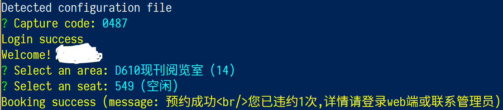

# `sdu-chiangchen` - Node.js API for Chiangchen Library Reservation System

This is a terminal client of seat reservation system of Chiang Chen Library,
which is located in the central campus of Shangdong University.

## Where is Chiangchen Library?

Chiangchen Library is located in the central campus of Shandong University.

## What's the purpose of this project?

The user experience of online seat reservation system of Chiangchen Library is
really awful. So I analyzed the API and made this tool.

## How to use this tool?

First make sure that you have Node.js installed, and clone this repo.
Then, install dependencies by npm and run:

```shell
npm install
npm run start
```
Then the prompts will instruct you.



## How to configure auto login?

Create a file named `config.json` with following content:

```json
{
  "username": "123456",
  "password": "y0ur p@ssword"
}
```

This file had been added in `.gitignore`, so it will not be tracked by git.

## License

MIT